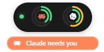
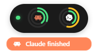

<p align="center">
  
</p>

<h1 align="center">BurnClaw</h1>

<p align="center">
  Your Claude and Codex usage, live in the Windows system tray.
</p>

<p align="center">
  
  
  
</p>

---

BurnClaw is a tiny desktop widget that lives in your Windows tray and shows how
much of your **Claude** and **OpenAI Codex** plans you've used — the rolling
5-hour window and the weekly window for each — read straight from their APIs. A
quick glance, no terminal, no browser tab. Track one provider or both.

It also reflects **agent activity** in real time: when Claude Code or Codex is
working, finishes, or needs your input, a small notification slides down under
the pill (orange for Claude, slate for Codex) and you get a native notification.

> [!NOTE]
> BurnClaw started as a personal project. It's published so anyone can use it,
> but it stays Windows-only and relies on unofficial endpoints — see
> [How it works](#how-it-works) before you depend on it.

## Contents

- [States](#states)
- [How it works](#how-it-works)
- [Requirements](#requirements)
- [Install](#install)
- [First run](#first-run)
- [Activity](#activity)
- [Settings](#settings)
- [Three signals, never mixed](#three-signals-never-mixed)
- [Tray icon](#tray-icon)
- [Tech stack](#tech-stack)
- [License](#license)

## States

BurnClaw is a single window that morphs between two states. Click the pill to
expand it; click the **✕** to collapse it back.

<!-- capture: the collapsed pill — status dot + one concentric dual-ring per provider (brand icon centered) -->
<!-- capture: the expanded widget — a block per provider (icon, name, plan) with session/weekly bars -->

| Pill (collapsed) | Widget (expanded) |
| :---: | :---: |
|  |  |

The **pill** shows a status dot plus one ring per tracked provider — two
concentric arcs, the 5-hour window outside and the 7-day window inside, with the
provider's icon in the centre. The **widget** breaks the same numbers out per
provider with progress bars, reset countdowns, a `DOMINANT` tag on whichever
window Anthropic is currently enforcing (Claude only), and a refresh button.

## How it works

**Claude.** Anthropic exposes a unified usage figure through the
`anthropic-ratelimit-unified-*` response headers — but only when you
authenticate as Claude Code. So BurnClaw **reuses the OAuth token Claude Code
already stores** (`%USERPROFILE%\.claude\.credentials.json`). Once a minute it
makes a minimal request to `api.anthropic.com` with the cheapest model
(Haiku, `max_tokens: 1`) and reads the rate-limit headers off the response.

**Codex.** BurnClaw reads the token Codex CLI stores
(`%USERPROFILE%\.codex\auth.json`) and queries the same internal usage endpoint
Codex clients use (`chatgpt.com/backend-api/wham/usage`). This is a **read-only**
call — it returns your usage directly and costs **no quota**.

The only network calls BurnClaw makes are to those usage endpoints and to
`status.claude.com` (service status). No telemetry, no analytics, no servers of
its own. It reads the credential files — it never modifies them.

> [!WARNING]
> **These are unofficial approaches.** Using Claude Code's OAuth token, or
> Codex's internal usage endpoint, from a client that isn't the official CLI is
> undocumented, ToS-gray territory. Either provider could block it at any time —
> they've changed similar things before. If BurnClaw suddenly stops working with
> an auth error, that's almost certainly why. For personal, low-frequency use
> the risk is low, but it's a risk you're accepting.

## Requirements

- **Windows 10 or 11.**
- **Claude Code and/or Codex CLI installed and logged in.** BurnClaw doesn't
  care which plan you're on — it just needs the OAuth token that `claude login`
  / `codex login` produces. Track either provider, or both.

## Install

Download the latest installer from the
[**Releases**](https://github.com/asantinos/burnclaw/releases) page, run it,
and BurnClaw appears in your tray. (Per-user install, no admin needed.)

<details>
<summary>Build from source</summary>

<br>

Requires [bun](https://bun.sh) and the
[Tauri prerequisites](https://v2.tauri.app/start/prerequisites/) for Windows
(Rust + the WebView2 runtime, which ships with Windows 11).

```bash
git clone https://github.com/asantinos/burnclaw.git
cd burnclaw
bun install

# run in development
bun run tauri dev

# build a release installer (ends up in src-tauri/target/release/bundle/)
bun run tauri build
```

</details>

## First run

On first launch you'll get a short setup wizard:

<!-- capture: the setup wizard — the Welcome step with the Claude / Codex / Both selector -->


1. **Welcome** — pick what to track: **Claude**, **Codex**, or **both**.
   BurnClaw auto-detects which CLIs you have installed and preselects them.
2. **Connection** — checks each chosen provider is signed in. If not, it can
   open `claude login` / `codex login` for you.
3. **Activity** — optionally wires up the integration (see below). You can skip
   this and do it later.
4. **Preferences** — start with Windows, polling interval.

When you're done, the pill appears next to the tray.

## Activity

The optional part that makes the widget react in real time. BurnClaw runs a tiny
HTTP server on `127.0.0.1:9876` (localhost only, never exposed to the network).

- **Claude Code** pings it directly via hooks (session start, tool calls, input
  requests, stop).
- **Codex** calls it through its `notify` command — BurnClaw registers itself as
  the notify handler and forwards the event.

| Needs you | Finished | Widget |
| :---: | :---: | :---: |
|  |  |  |

When an agent is active, a notification slides down under the pill — **orange for
Claude, slate for Codex** — with what it's doing ("working…", "needs you",
"finished"). You choose which events trigger it, per provider, and how long it
stays, in Settings. Expanded, the widget also shows a console banner, and you
get a native OS notification when an agent finishes or is waiting for you.

The wizard (or **Settings → Integration**) can install this for you: Claude's
hooks merge into `~/.claude/settings.json`, Codex's handler into
`~/.codex/config.toml` — both with a `.bak` backup, never clobbering what you
already have. For the Claude hooks by hand, see [HOOKS_SETUP.md](HOOKS_SETUP.md).

## Settings

Right-click the tray icon → **Settings**. Everything applies live — no restart.

<!-- capture: the Settings window — the Providers section showing both Claude and Codex connected -->


- **Providers** — connection status, plan and credential file for Claude and
  Codex.
- **Integration** — install/remove Claude Code hooks and the Codex notify
  handler.
- **Activity** — the slide-down pill panel (enable per provider, pick which
  events, auto-dismiss timing) and the widget console banner.
- **Notifications** — usage thresholds and per-type native notification toggles.
- **Behavior** — start with Windows, start mode, polling interval.
- **About** — version, links, logs, and a full reset.

## Three signals, never mixed

BurnClaw shows three independent things and keeps them on separate visual
channels on purpose — they never share an element:

| Signal | Where it shows |
| --- | --- |
| **Usage** | Pill rings / widget bars, and the tray icon color |
| **Service status** | The status dot (from `status.claude.com`) |
| **Agent activity** | The slide-down pill panel + console banner |

## Tray icon

The tray icon color follows the **highest** usage window across every tracked
provider:

| Usage | Icon | Notification |
| --- | :---: | --- |
| Starting up |  | — |
| 0–49% |  | — |
| 50–79% |  | — |
| 80–94% |  | once, when crossed |
| 95–100% |  | once, when crossed |

- **Left-click** the tray icon to show/hide the window.
- **Right-click** for *Refresh now*, *Settings*, *Quit*.

Hovering the icon shows a plain-text summary, one line per provider
(`Claude · 5h 25% (2h 14m)`). The thresholds and which notifications fire are
configurable in Settings.

## Tech stack

Tauri 2 + Rust backend + vanilla TypeScript frontend, built with
[bun](https://bun.sh). It was chosen over Electron deliberately: a tray widget
that runs 24/7 should be measured in single-digit MB, not hundreds.

## License

[MIT](LICENSE) © [asantinos](https://github.com/asantinos)
