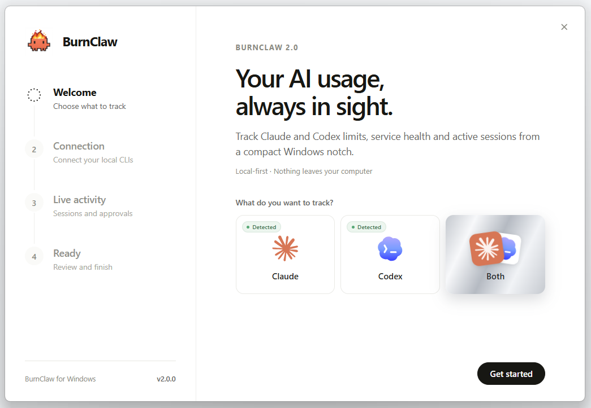
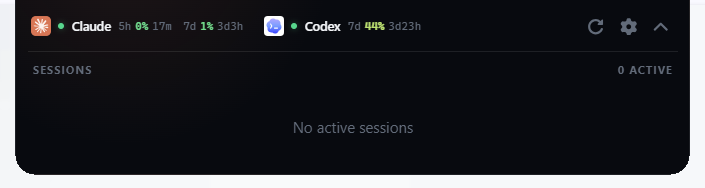
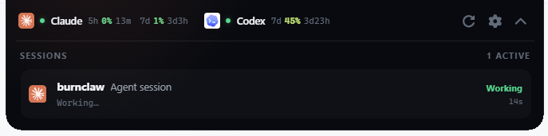
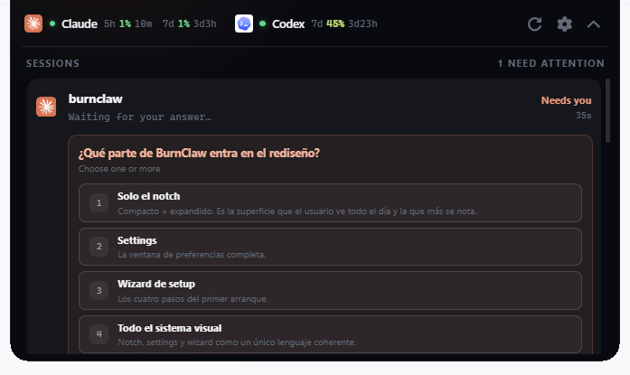
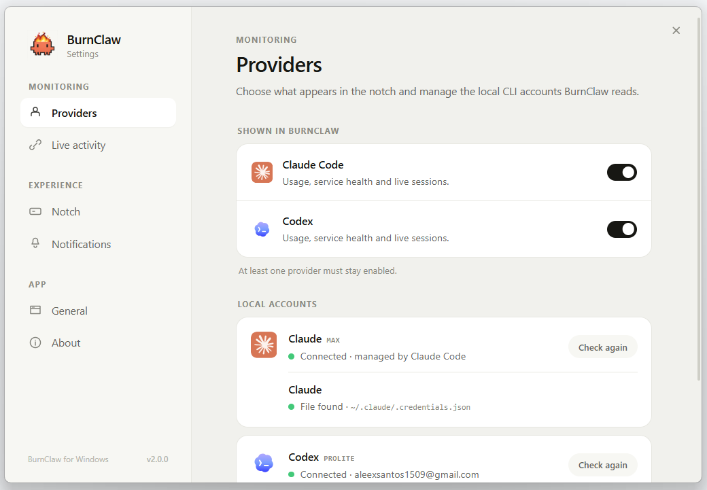

<p align="center">
  
</p>

<h1 align="center">BurnClaw 2.0</h1>

<p align="center">
  A compact Windows notch for Claude Code and Codex usage, service health and live sessions.
</p>

<p align="center">
  
  
  
  
</p>

BurnClaw lives at the top of the desktop and keeps the information that normally
requires several terminal commands or browser tabs in one small surface. Track
Claude Code, Codex, or both.

<p align="center">
  
</p>

## What it does

- Shows current usage and the remaining time until each limit resets.
  - **Claude:** rolling 5-hour and 7-day limits.
  - **Codex:** the current 7-day limit. BurnClaw retains compatibility with a
    shorter window if OpenAI exposes one again.
- Checks Claude and Codex service health independently.
- Detects local Claude Code and Codex sessions through optional lifecycle hooks.
- Uses simple activity labels such as **Working**, **Editing** and **Waiting**.
- Surfaces questions and approval requests and lets you respond from the
  expanded notch when the provider hook supports it.
- Sends configurable Windows notifications for usage, finished tasks, requests
  that need attention and service incidents.
- Runs from the system tray and can start automatically with Windows.
- Auto-hides the compact notch towards the top edge. Hover near it to reveal it,
  or use the pin to keep it visible.

BurnClaw is not a replacement chat client. Interactive controls are limited to
questions and permission requests received through the provider lifecycle hooks.

## Requirements

- Windows 10 or Windows 11.
- Claude Code and/or Codex installed locally.
- An authenticated CLI session for each provider you want to track:
  - `claude login`
  - `codex login` using a ChatGPT account

Codex API-key authentication can run Codex, but it does not expose the ChatGPT
plan quota that BurnClaw displays.

## Install

Download the latest `.exe` installer from
[GitHub Releases](https://github.com/asantinos/burnclaw/releases). BurnClaw uses
a per-user NSIS installer, so administrator access is not normally required.

On first launch, the setup wizard guides you through four steps:

1. **Welcome** - choose Claude, Codex or both.
2. **Connection** - detect the local CLIs and sign in if needed.
3. **Live activity** - optionally install the lifecycle hooks used for sessions,
   questions and approvals.
4. **Ready** - review the configuration and choose whether BurnClaw starts with
   Windows.

Usage and service health work without live activity. The hooks are only required
for the session list, real-time activity and interactive requests.

<p align="center">
  
</p>

## The notch

The compact notch shows provider usage, service state, current activity and the
number of active sessions without taking unnecessary desktop space.

- Click it to open the session panel.
- Use the upward chevron to return to the compact view.
- Leave it unpinned to auto-hide after a short delay.
- Move the cursor to the top-center edge of the screen to reveal it again.
- Hover the compact notch and select the pin to keep it visible. The pin choice
  persists between launches.

While hidden, the BurnClaw window ignores pointer input so it does not block
clicks in the application underneath it.

| Pinned | Auto-hidden |
| :---: | :---: |
|  |  |

<p align="center">
  
</p>

## Live sessions and interactive requests

BurnClaw runs a small HTTP listener on `127.0.0.1:9876`. It is bound to localhost
only and receives lifecycle events from the two local CLIs.

<p align="center">
  
</p>

When a provider needs input, the same panel can show the question and its
available answers without exposing the underlying technical hook details.

<p align="center">
  
</p>

### Claude Code

BurnClaw merges its entries into `%USERPROFILE%\.claude\settings.json` and
preserves unrelated hooks. The integration covers session start/end, prompts,
tool activity, subagents, notifications, questions and permission requests.

### Codex

BurnClaw installs its entries in `%USERPROFILE%\.codex\hooks.json`, preserves
unrelated hooks and removes the older BurnClaw `notify` integration if present.
The current bridge covers session lifecycle, prompts, tool activity, questions
and permission requests.

After installing or updating hooks, restart the corresponding CLI so it reloads
its configuration. BurnClaw also repairs its own outdated hook entries after an
app update without replacing hooks owned by other tools.

When a session ends normally, BurnClaw removes it after the session-end event.
It also monitors the owning CLI process and removes stale sessions if that
process exits without delivering the final event.

## Usage and service data

### Claude

BurnClaw reads the OAuth credentials already stored by Claude Code and makes a
minimal request to Anthropic. The rate-limit response headers provide the 5-hour
and weekly utilization and their reset times.

### Codex

BurnClaw reads the local Codex authentication file and requests plan usage from
the same read-only ChatGPT usage endpoint used by Codex clients. The response is
parsed defensively because the endpoint is not a public API.

### Service health

- Claude health comes from `status.claude.com`.
- Codex health comes from the Codex-specific components on `status.openai.com`,
  avoiding unrelated OpenAI incidents where possible.

## Settings

Open **Settings** from the tray menu to configure:

- **Providers** - choose what BurnClaw tracks and inspect local account state.
- **Live activity** - install, repair or remove Claude and Codex hooks.
- **Notch** - choose which activity states open the temporary panel and how long
  it remains visible.
- **Notifications** - set warning/critical usage thresholds and Windows alerts.
- **General** - start with Windows, initial compact/expanded view and refresh
  interval.
- **About** - open logs, report an issue or reset BurnClaw and run setup again.

Settings are stored under the user's application configuration directory.
Resetting BurnClaw does not delete Claude Code or Codex credentials.

<p align="center">
  
</p>

## Privacy and caveats

- BurnClaw has no telemetry, analytics or hosted backend.
- Credentials are read from the local CLI files and sent only to the relevant
  provider endpoint as part of authenticated usage checks.
- Lifecycle events stay on the local machine and are sent only to the localhost
  listener.
- Existing hook configuration is preserved and backed up before BurnClaw edits
  it.

The usage integrations rely on provider behavior that is not guaranteed as a
stable public API. Anthropic or OpenAI may change credential formats, headers or
usage endpoints. If tracking stops after a provider update, check BurnClaw logs
and update to the latest release before signing in again.

## Build from source

You need:

- [Bun](https://bun.sh/)
- Rust with the MSVC target
- Visual Studio Build Tools with **Desktop development with C++**
- The [Tauri 2 Windows prerequisites](https://v2.tauri.app/start/prerequisites/)

```powershell
git clone https://github.com/asantinos/burnclaw.git
cd burnclaw
bun install

# Development
bun run tauri dev

# Production installer
bun run tauri build
```

The NSIS installer is generated under:

```text
src-tauri/target/release/bundle/nsis/
```

## Publishing a release

The release workflow in `.github/workflows/release.yml` runs whenever a tag
matching `v*` is pushed. It verifies that the tag, `package.json`, Tauri config
and Cargo package all use the same version, then runs the frontend build and
Rust tests on a Windows runner.

If every check passes, GitHub builds the NSIS installer and creates a **draft
release** with generated release notes and the `.exe` attached. Review the draft
in GitHub and select **Publish release** when it is ready.

After updating every project version and committing it, the tag can be derived
from `package.json` to avoid entering a different version manually:

```powershell
$version = (Get-Content package.json -Raw | ConvertFrom-Json).version
git tag "v$version"
git push origin main
git push origin "v$version"
```

The workflow uses GitHub's built-in token and does not require a custom secret.
Windows code signing is not configured yet, so SmartScreen may still warn about
an unrecognized publisher.

## Verification

```powershell
# TypeScript and production frontend
bun run build

# Rust unit tests
cargo test --manifest-path src-tauri/Cargo.toml
```

## Tech stack

BurnClaw uses Tauri 2, Rust and vanilla TypeScript. The small native shell keeps
the always-running widget substantially lighter than an Electron application.

## License

[MIT](LICENSE) © [asantinos](https://github.com/asantinos)
