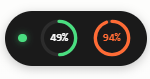
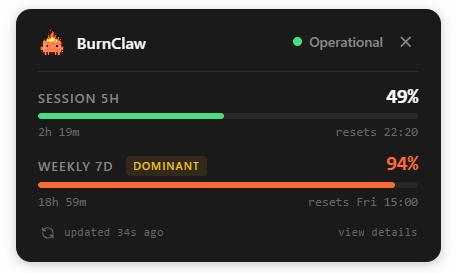
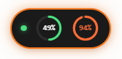
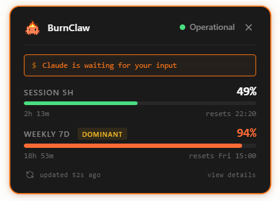

<p align="center">
  
</p>

<h1 align="center">BurnClaw</h1>

<p align="center">
  Your Claude usage, live in the Windows system tray.
</p>

<p align="center">
  
  
  
</p>

---

BurnClaw is a tiny desktop widget that lives in your Windows tray and shows how
much of your Claude plan you've used — the rolling 5-hour window and the weekly
window — read straight from the Anthropic API. A quick glance, no terminal, no
browser tab.

It also reflects **Claude Code activity** in real time: while a session is
running the widget gets an orange border and a small console banner, and you
get a native notification when Claude finishes or needs you.

> [!NOTE]
> BurnClaw started as a personal project. It's published so anyone can use it,
> but it stays Windows-only and relies on an unofficial OAuth approach — see
> [How it works](#how-it-works) before you depend on it.

## Contents

- [States](#states)
- [How it works](#how-it-works)
- [Requirements](#requirements)
- [Install](#install)
- [First run](#first-run)
- [Activity hooks](#activity-hooks)
- [Settings](#settings)
- [Three signals, never mixed](#three-signals-never-mixed)
- [Tray icon](#tray-icon)
- [Tech stack](#tech-stack)
- [License](#license)

## States

BurnClaw is a single window that morphs between two states. Click the pill to
expand it; click the **✕** to collapse it back.

<!-- capture: the collapsed pill — status dot + two progress rings (session, weekly) -->
<!-- capture: the expanded widget — header, both metric bars with resets, footer -->

| Pill (collapsed) | Widget (expanded) |
| :---: | :---: |
|  |  |

The **pill** is a status dot plus two rings: the 5-hour session window and the
7-day weekly window. The **widget** breaks the same numbers out with progress
bars, reset countdowns, a `DOMINANT` tag on whichever window Anthropic is
currently enforcing, and a refresh button.

## How it works

Anthropic exposes a unified usage figure through the
`anthropic-ratelimit-unified-*` response headers — but only when you
authenticate as Claude Code. A normal API key doesn't get them.

So BurnClaw **reuses the OAuth token that Claude Code already stores** on your
machine (`%USERPROFILE%\.claude\.credentials.json`). Once a minute it makes a
minimal request to `api.anthropic.com` using the cheapest model
(Haiku, `max_tokens: 1`), reads the rate-limit headers off the response, and
updates the tray. That's roughly 3% of a Max 5x session window per day — small,
but not zero, and configurable down further in Settings.

The only network calls BurnClaw makes are to `api.anthropic.com` (usage) and
`status.claude.com` (service status). No telemetry, no analytics, no servers of
its own. It reads `.credentials.json` — it never modifies it.

> [!WARNING]
> **This is an unofficial approach.** Using Claude Code's OAuth token from a
> client that isn't Claude Code is an undocumented, ToS-gray area. Anthropic
> could block it at any time — they've changed similar things before. If
> BurnClaw suddenly stops working with an auth error, that's almost certainly
> why. For personal, low-frequency use the risk is low, but it's a risk you're
> accepting.

## Requirements

- **Windows 10 or 11.**
- **Claude Code installed and logged in.** BurnClaw doesn't care whether you're
  on Pro or Max — it just needs the OAuth token that `claude login` produces.

## Install

Download the latest installer from the
[**Releases**](https://github.com/asantinos/burnclaw/releases) page, run it,
and BurnClaw appears in your tray.

<details>
<summary>Build from source</summary>

<br>

Requires [bun](https://bun.sh) and the
[Tauri prerequisites](https://v2.tauri.app/start/prerequisites/) for Windows
(Rust + the WebView2 runtime, which ships with Windows 11).

```bash
git clone https://github.com/asantinos/burnclaw.git
cd burnclaw
bun install

# run in development
bun run tauri dev

# build a release installer (ends up in src-tauri/target/release/bundle/)
bun run tauri build
```

</details>

## First run

On first launch you'll get a short setup wizard:

<!-- capture: the setup wizard, e.g. the Connection step showing "Connected — max plan" -->


1. **Welcome** — what BurnClaw is.
2. **Connection** — checks that Claude Code is signed in. If not, it can open
   `claude login` for you.
3. **Activity hooks** — optionally wires up the Claude Code integration (see
   below). You can skip this and do it later.
4. **Preferences** — start with Windows, polling interval.

When you're done, the pill appears next to the tray.

## Activity hooks

This is the optional part that makes the widget react to Claude Code in real
time. BurnClaw runs a tiny HTTP server on `127.0.0.1:9876` (localhost only,
never exposed to the network) and Claude Code pings it on lifecycle events —
session start, tool calls, input requests, stop.

| Pill | Widget |
| :---: | :---: |
|  |  |

While a session runs the border turns orange. Expanded, the widget also shows a
console banner with what Claude is doing right now, and you get a native
notification when Claude finishes or is waiting for you.

The wizard can install the hooks for you (it merges into your
`~/.claude/settings.json` and keeps a `.bak`, never overwriting hooks you
already have). To do it by hand, or to understand exactly what gets added, see
[HOOKS_SETUP.md](HOOKS_SETUP.md).

## Settings

Right-click the tray icon → **Settings**. Everything applies live — no restart.

<!-- capture: the Settings window, e.g. the Advanced section with thresholds + notification toggles -->


- **Account** — connection status and the credentials file BurnClaw reads.
- **Activity hooks** — install/remove the hooks, toggle the orange border and
  console banner.
- **Behavior** — start with Windows, start mode, polling interval.
- **Advanced** — notification thresholds, per-type notification toggles, log
  files, and a full reset.
- **About** — version, license, links.

## Three signals, never mixed

BurnClaw shows three independent things and keeps them on separate visual
channels on purpose — they never share an element:

| Signal | Where it shows |
| --- | --- |
| **Usage** | Pill rings / widget bars, and the tray icon color |
| **Claude service status** | The status dot (from `status.claude.com`) |
| **Claude Code activity** | Orange border + console banner |

## Tray icon

The tray icon color follows the **higher** of your two usage windows:

| Usage | Icon | Notification |
| --- | :---: | --- |
| Starting up |  | — |
| 0–49% |  | — |
| 50–79% |  | — |
| 80–94% |  | once, when crossed |
| 95–100% |  | once, when crossed |

- **Left-click** the tray icon to show/hide the window.
- **Right-click** for *Refresh now*, *Settings*, *Quit*.

Hovering the icon shows a plain-text summary (`Session 47% · Weekly 28% · Resets
in 2h 14m`). The thresholds and which notifications fire are configurable in
Settings.

## Tech stack

Tauri 2 + Rust backend + vanilla TypeScript frontend, built with
[bun](https://bun.sh). It was chosen over Electron deliberately: a tray widget
that runs 24/7 should be measured in single-digit MB, not hundreds.

## License

[MIT](LICENSE) © [asantinos](https://github.com/asantinos)
